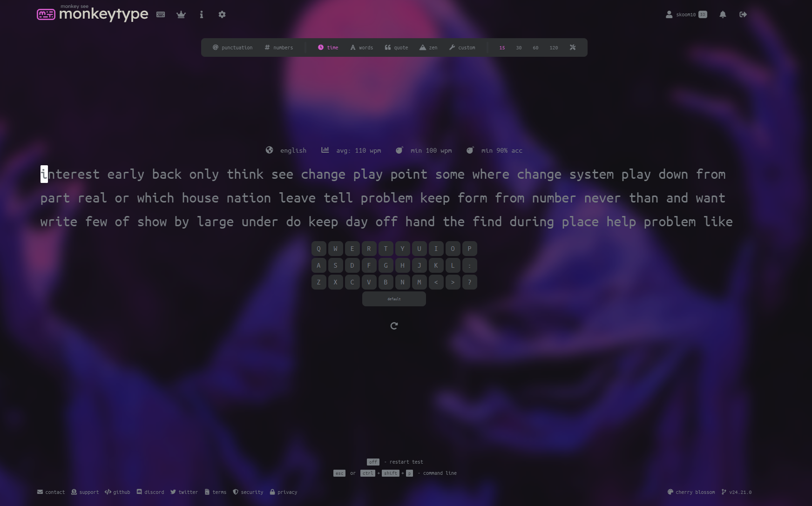

# MonkeyType-Template
My personal Monkeytype Template:
add a img here and make it wide 

## Installation

## Steps to Import Settings in Monkeytype

1. Navigate to [https://monkeytype.com/settings/import](https://monkeytype.com/settings/import)
   
2. Click this link.

![Step 2]

1. Click "go to the danger zone".

![Step 3]

1. Click "import".

![Step 4]

1. Click the text field.

![Step 5]

1. Press `CTRL` + `V`.

2. Click "import settings".
